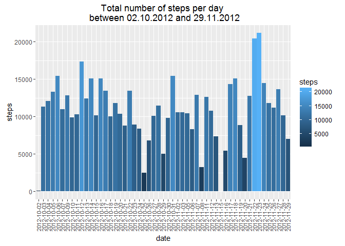
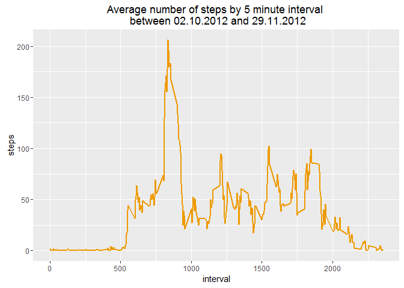
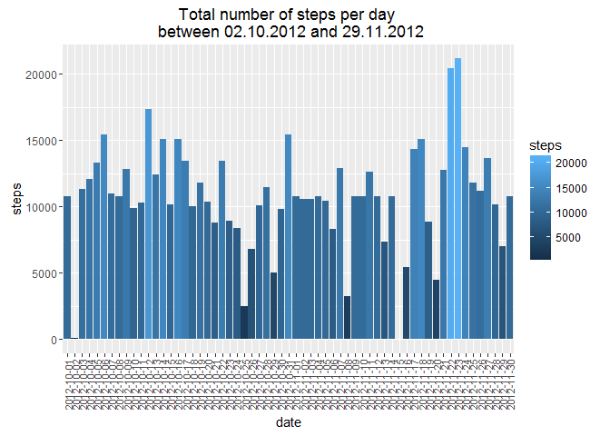
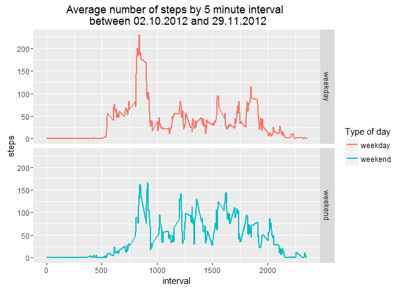

# Reproducible Research: Peer Assessment 1 by Jubijub


## Loading and preprocessing the data

### Downloading data from the web


```r
projectData <- "https://d396qusza40orc.cloudfront.net/repdata%2Fdata%2Factivity.zip"
zipFile <- "./activity.zip"

if (!file.exists(zipFile)){download.file(projectData, zipFile)}
message("Source File downloaded")
```

```
## Source File downloaded
```

```r
if(file.exists(zipFile)){unzip(zipfile=zipFile, exdir=".")}
message("ZIP content extracted")
```

```
## ZIP content extracted
```

### Loading the activities


```r
activity <- read.csv("activity.csv", header=TRUE)
```

### Process/transform the data (if necessary) into a format suitable for your analysis
No transformation is made upfront as the questions require different transformation, that will be performed along each step.


##What is mean total number of steps taken per day?
###Calculate the total number of steps taken per day

```r
stepsperdaySum <- aggregate(steps~date, data=activity, sum, na.rm=TRUE)
meantotalsteps <- mean(stepsperdaySum$steps)
```
**The mean total number of steps taken per day was 10766.19.**

###Make a histogram of the total number of steps taken each day
The histogram below will represent the total amount of steps for each day, colored based on the level of activity.


```r
library(ggplot2)
g <- ggplot(stepsperdaySum, aes(x = date, y = steps))
g + geom_bar(stat = "identity", aes(fill = steps)) + ggtitle("Total number of steps per day \n between 02.10.2012 and 29.11.2012") +
    theme(axis.text.x= element_text(angle=90, vjust=0.5, size=8))
```

<!-- -->

###Calculate and report the mean and median of the total number of steps taken per day

```r
meandailysteps <- mean(stepsperdaySum$steps)
mediandailysteps <- median(stepsperdaySum$steps)
```

**The mean total of steps per day is 10766.19.**  
**The median total of steps per day is 10765.**

## What is the average daily activity pattern?

###Make a time series plot (i.e. type = "l") of the 5-minute interval (x-axis) and the average number of steps taken, averaged across all days (y-axis)

```r
stepsperintervalAvg <- aggregate(steps~interval, data=activity, mean, na.rm=TRUE)
g <- ggplot(stepsperintervalAvg, aes(x=interval, y=steps))
g + 
    geom_line(color="orange2", size=1) +
    ggtitle("Average number of steps by 5 minute interval \n between 02.10.2012 and 29.11.2012")
```

<!-- -->

###Which 5-minute interval, on average across all the days in the dataset, contains the maximum number of steps?

```r
maxInterval <- stepsperintervalAvg$interval[which.max(stepsperintervalAvg$steps)]
```
The interval with the maximum number of steps is the interval 835.

## Imputing missing values
### Calculate and report the total number of missing values in the dataset (i.e. the total number of rows with NAs)

```r
missingValues <- sum(is.na(activity$steps))
```
There are originally 2304 missing values.

###Devise a strategy for filling in all of the missing values in the dataset

**Strategy :** replace missing values by the intervel average over all days
   * Pro : it factors intra day patterns (no activity at night, etc...)
   * Cons : it ignores daily over / under activity
`stepsperintervalAvg` is computed first, to know the average per interval.
Missing data is added to the original dataset via the `merge` command.

###Create a new dataset that is equal to the original dataset but with the missing data filled in.

```r
stepsperintervalAvg <- aggregate(steps~interval, data=activity, mean, na.rm=TRUE)

activityIntv <- merge(activity, stepsperintervalAvg, by="interval", suffixes = c("", "y"))
missingValues <- is.na(activityIntv$steps)
activityIntv$steps[missingValues] <- activityIntv$stepsy[missingValues]

activity <- activityIntv[, c(1:3)]
missingValues <- sum(is.na(activity$steps))
```
There are now 0 missing values in the new dataset `activity`.

###Make a histogram of the total number of steps taken each day and Calculate and report the mean and median total number of steps taken per day.

```r
stepsperdaySum <- aggregate(steps~date, data=activity, sum)

g <- ggplot(stepsperdaySum, aes(x = date, y = steps))
g + geom_bar(stat = "identity", aes(fill = steps)) + ggtitle("Total number of steps per day \n between 02.10.2012 and 29.11.2012") +
    theme(axis.text.x= element_text(angle=90, vjust=0.5, size=8))
```

<!-- -->


```r
intvMean <- mean(stepsperdaySum$steps)
intvMedian <- median(stepsperdaySum$steps)
```
After filling missing values with the interval average, the new values are :

* mean : 10766.19
* median : 10766.19

Filling missing values this way doesn't impact the result very much, as the values are almost identical (the mean stays the same, the median shows very little changes).
Using average to fill missing value doesn't change global mean/median significantly.


## Are there differences in activity patterns between weekdays and weekends?
###Create a new factor variable in the dataset with two levels - "weekday" and "weekend" indicating whether a given date is a weekday or weekend day.


```r
day.type <- function(date) {
    # weekdays() was not used at it returns a result that is locale specific
    # (on my computer it yields Samedi/dimanche)
    # Using posix date day of week index works everywhere.
    # Sunday is 0, Saturday is 6, and 0%6 and 6%6 both = 0
    if (as.POSIXlt(as.Date(date))$wday%%6==0){
        "weekend"
    } else {
        "weekday"
    }
}
activity$day.type <- as.factor(sapply(activity$date, day.type))
```

###Make a panel plot containing a time series plot (i.e. type = "l") of the 5-minute interval (x-axis) and the average number of steps taken, averaged across all weekday days or weekend days (y-axis)


```r
stepsinterval <- aggregate(steps ~ interval + day.type, activity, mean)
g <- ggplot(stepsinterval, aes(x=interval, y=steps))
g + 
    geom_line(size=1, aes(color=day.type)) +
    scale_colour_discrete(name="Type of day") +
    facet_grid(day.type ~ .) +
    ggtitle("Average number of steps by 5 minute interval \n between 02.10.2012 and 29.11.2012")
```

<!-- -->
